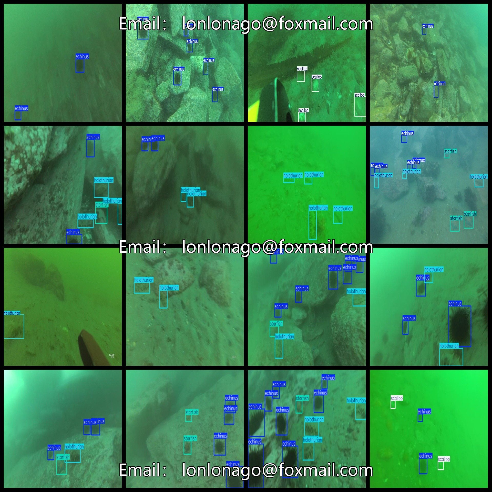
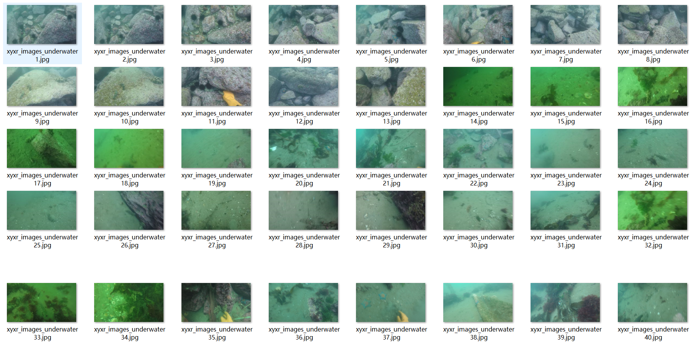

# [Object Detection] Sea Base Sea Urchin Sea Participating Fan Shellfish Starfish Dataset
5457 images in YOLO+VOC format

[Object Detection] This dataset includes a collection of images, annotations, and labels for sea urchins, sea cucumbers, fan shellfish, starfish, and water weeds. The dataset is organized into three folders: JPEGImages, Annotations, and labels.

The JPEGImages folder contains a total of 5457 JPEG images, categorized by their respective tags. The Annotations folder consists of 5457 XML files, while the labels folder contains 5457 txt files.

The dataset features a diverse set of labels with five categories: ["echinus", "holothurian", "scallop", "starfish", "waterweeds"]. Each category has its own set of labeled frames, which are essential for accurate object detection and recognition.

The number of labeled frames for each category varies:
- echinus: 22326
- holothurian: 5529
- scallop: 6683
- starfish: 6838
- waterweeds: 81

The total number of labeled frames across all categories is 41457.

All images are of high resolution (pixel count) and have been enhanced to maintain their clarity and quality for training purposes.

It is important to note that this dataset does not guarantee the accuracy or precision of any trained models or weight files. It only provides accurate and reasonable annotations for the purpose of object detection.

Special Statement: This dataset does not provide any guarantees regarding the accuracy or precision of the models trained on it or any associated weight files. It solely serves as an accurate and reasonable annotation source for object detection tasks.

## Images

---

Here is a pay link on Stripe (https://buy.stripe.com/3cs8yP7sY87d0vu9AB). Please contact me lonlonago@foxmail.com after funding $89, and I will send you a complete data files, thank you!

